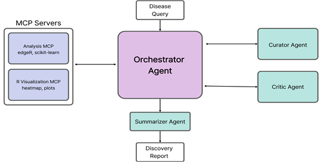
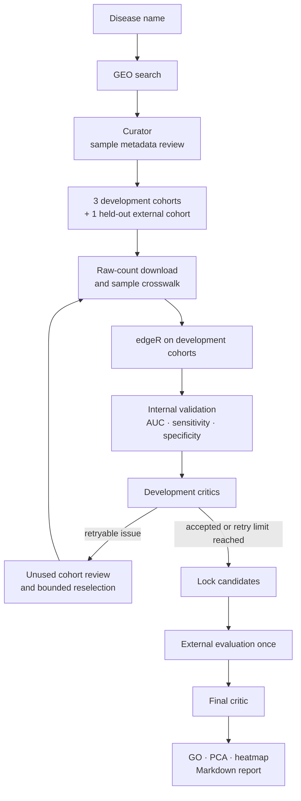

# RNAHero

RNAHero는 질환명 입력으로 GEO 기반 bulk RNA-seq 연구를 탐색, 선별하고 edgeR과 scikit-learn을 활용해 바이오마커 후보를 발굴·검증하는 멀티 에이전트 시스템입니다.

데이콘 제 4회 인공지능(AI) 신약개발 경진대회(4th JUMP AI, fourth.py) 출품작
**47위 / 507팀**

## Introduction

최근 RNA-seq 기반 바이오마커 발굴은 신약개발 초기 단계에서 질병 타겟 탐색, 환자군 분류, 약물 후보 발굴 등에 널리 활용되고 있다. 하지만 현재 연구에서는 적절한 GEO 데이터셋을 찾아서 환자군과 대조군을 분류하고, raw count 데이터를 정제하여 차등발현 분석(edgeR)을 거친 후 내부 및 외부 검증, 결과 보고서를 작성하기까지 대부분의 과정을 연구자가 직접 수행해야 한다. 이러한 과정은 많은 시간이 소요될 뿐 아니라 연구자의 경험에 따라 분석 결과의 재현성이 달라질 수 있다.

본 연구에서는 이러한 문제를 해결하기 위해 RNAHero라는 AI 에이전트를 제안한다. RNAHero는 사용자가 질환명만 입력하면 GEO를 검색하는 과정부터 메타데이터 검증, 코호트 선정, edgeR 기반 DEG(Differentially expressed genes) 분석, 바이오마커 검증, AI 기반 비판적 평가 및 최종 보고서 생성까지 전 과정을 자율적으로 수행한다. 이를 통해 반복적이고 시간이 많이 소요되는 RNA-seq 분석을 자동화하여 연구자가 후보 바이오마커의 기능 탐색과 후속 실험 설계에 집중할 수 있도록 지원한다.

또한 본 에이전트는 단순하게 DEG 탐색을 하는 것을 넘어서는, 내부 교차 검증과 외부 독립 코호트 검증을 포함한 신뢰성 중심의 바이오마커 발굴을 목표로 하며, 연구 재현성을 향상시키는 것을 핵심 가치로 한다.

## Architecture



GEO를 이용한 바이오마커 발굴에는 세 가지 문제가 있습니다. 먼저 GEO의 sample metadata는 연구자가 입력한 반정형 텍스트라 질환군과 대조군, 조직, 실험 조건을 일관되게 구분하기 어렵습니다. [Wang et al. (2019)](https://doi.org/10.1007/s12551-018-0490-8)은 GEO 재사용 과정에서 표준화된 metadata가 부족하다는 점을 다뤘고, [Lohr et al. (2015)](https://doi.org/10.1007/s00204-015-1632-4)은 잘못된 sample annotation이 실제 통계 결과에 영향을 줄 수 있음을 보였습니다.

한 cohort에서 찾은 후보가 다른 환자 집단이나 측정 플랫폼에서도 재현된다는 보장도 없습니다. 여기에 후보를 고르는 동안 external data를 반복해서 확인하면 평가 데이터에 맞춰지는 leakage가 생길 수 있습니다. RNA-seq 연구는 아니지만, [Rosenblatt et al. (2024)](https://doi.org/10.1038/s41467-024-46150-w)은 feature selection을 포함한 leakage가 예측 성능을 부풀릴 수 있음을 실험적으로 보였습니다. RNAHero는 이 세 문제를 metadata 검토, development cohort 교차 검증, held-out external cohort의 1회 평가로 나누어 다룹니다.

구현은 Python 3.11을 중심으로 Gemini API와 Google ADK, 로컬 NCBI GEO MCP server, R/Bioconductor의 edgeR, scikit-learn 검증 모듈을 연결하여 만들었습니다. LLM은 metadata 해석과 workflow 조정에 사용하고, 후보 선정 및 성능 평가는 Python·R 코드에서 수행합니다. 때문에 에이전트가 임의로 FDR, cutoff, cohort 등을 바꿀 수 없습니다.

### Pipeline



external cohort는 후보 선택, 방향 결정, cutoff 조정에 쓰지 않습니다. 재선정도 development 결과와 critic이 반환한 사유만 보고 결정합니다.

실행 과정은 다음과 같습니다.

1. Orchestrator가 질환명을 받아 GEO 검색을 시작합니다. 검색 요청 규모는 최소 20개로 잡고 최대 25개 후보를 검토합니다.
2. Curator가 GSM metadata를 읽고 case/control 근거를 sample 단위로 기록합니다. 정규화 행렬이나 소수 count는 제외하며, count column과 GSM accession이 고유하게 대응될 때만 group을 배정합니다.
3. 선정한 3개 development cohort와 1개 external cohort를 `metadata.json`, `counts.csv`, `samples.csv`, `crosswalk.json`으로 정리합니다. 표본 구성이 불분명하면 분석을 강행하지 않습니다.
4. edgeR이 각 development cohort의 FDR, logFC, logCPM을 계산합니다. 각 cohort를 번갈아 discovery로 두고 나머지 두 cohort에서 AUC, sensitivity, specificity를 구합니다.
5. 내부 기준을 모두 통과한 후보를 lock한 뒤 external cohort에서 한 번만 평가합니다. 이 결과는 후보 선택이나 임계값 조정에 반영되지 않습니다.
6. Development Critic은 cohort별 문제를 reason code로 반환합니다. 재시도 가능한 문제라면 Orchestrator가 사용하지 않은 cohort를 검토하며, 반복 횟수는 `max_loop_rounds`로 제한됩니다.
7. 후보가 확정되면 Final Critic이 전체 검증을 읽기 전용으로 점검하고, Summarizer가 PCA, heatmap, GO enrichment와 Markdown 보고서를 생성합니다.

### Components

| Component | Responsibility | Does not change |
| --- | --- | --- |
| NCBI GEO tools | 연구 검색, GSM metadata 수집, raw-count 다운로드 | 바이오마커 결론 |
| Gemini Curator | 최대 4개 연구를 한 묶음으로 검토하고 sample별 포함 근거를 기록 | edgeR 결과와 검증 기준 |
| Orchestrator | 3개 development와 1개 external cohort 선택, 재시도 예산 관리 | held-out 결과를 이용한 후보 선택 |
| edgeR | 차등발현 분석과 log-CPM 산출 | cohort 역할 |
| scikit-learn validation | ROC AUC와 confusion matrix 기반 sensitivity·specificity 계산 | FDR, 방향, cutoff |
| Development Critic | cohort별 내부 검증과 재현성 문제를 사유 코드로 반환 | external 결과 평가 |
| Final Critic | 확정된 내부·외부 검증의 한계와 해석 가능성 점검 | 후보 순위와 기준 |
| Summarizer | 고정된 결과와 그림 경로를 Markdown 보고서로 정리 | 후보 재순위화 |

Gemini 호출이 실패하면 development 검토는 결정론적 검사로 대체됩니다. 분석 기준과 후보 점수 계산은 에이전트가 아니라 Python과 R 코드가 담당합니다.


## Requirements

- Python 3.11 이상
- R 및 `edgeR` 패키지
- Gemini API key: 자동 cohort 검토와 보고서 작성에 필요하며, 수동 pipeline만 실행할 때는 선택 사항

R에서 edgeR를 설치합니다.

```r
if (!requireNamespace("BiocManager", quietly = TRUE))
    install.packages("BiocManager")
BiocManager::install("edgeR")
```

## Installation

```powershell
cd .\RNAHero
python -m venv .venv
.\.venv\Scripts\python -m pip install -e ".[agent]"
```

프로젝트 루트의 `.env`에 Gemini 설정을 추가합니다.

```text
GEMINI_API_KEY=your_key
GEMINI_MODEL=gemini-3.5-flash-lite
```

NCBI E-utilities의 호출 한도를 높이고 싶다면 다음 값도 설정할 수 있습니다.

```text
NCBI_API_KEY=your_ncbi_key
NCBI_EMAIL=you@example.com
```

## Quick Start

```powershell
.\.venv\Scripts\rnahero.exe run "lung adenocarcinoma" --output output --max-loop-rounds 2
```

`--max-loop-rounds`는 development cohort 재선정 횟수입니다. CLI와 웹의 기본값은 2이며, 재시도하지 않으려면 0을 지정합니다.

로컬 웹 화면도 사용할 수 있습니다.

```powershell
.\.venv\Scripts\rnahero.exe web
```

브라우저에서 `http://127.0.0.1:8000`을 엽니다.

중단된 분석은 저장된 GEO 파일과 완료된 edgeR 결과를 재사용합니다.

```powershell
.\.venv\Scripts\rnahero.exe resume --output output
```

분석 결과에서 보고서와 그림만 다시 만들 수도 있습니다.

```powershell
.\.venv\Scripts\rnahero.exe summarize --output output
```

## Evaluation

### Evaluation Dataset

평가 데이터는 development cohort와 held-out external cohort로 분리합니다. 서로 독립적인 GEO bulk RNA-seq 연구 3개를 development cohort로 사용하고, 각 cohort를 한 번씩 discovery로 두어 나머지 두 cohort에서 내부 검증합니다. 후보 선정에는 external cohort를 사용하지 않으며, 내부 검증을 마친 후보만 마지막에 평가합니다.

### Agent Evaluation

최종 AUC만 확인하지 않고 각 agent가 맡은 일을 제대로 수행했는지도 함께 기록합니다.

| Agent | Evaluation |
| --- | --- |
| Orchestrator | Curator 호출, 단계 전환, cohort 재선정과 `max_loop_rounds` 준수 여부 |
| Curator | metadata 근거의 출처, case/control 판정, 불확실한 sample의 제외 여부 |
| Development Critic | reason code의 적절성, 내부 검증과 cohort 재현성 문제 식별 여부 |
| Final Critic | 내부·외부 검증 결과와 통계적 한계를 읽기 전용으로 점검했는지 여부 |
| Summarizer | 최종 Markdown 보고서 생성, PCA·heatmap·GO enrichment 포함 여부 |

각 실행의 agent 호출과 결정은 `run_manifest.json`, `curator_assessments.json`, `critic_GSE...json`, `critic_report.json`에 나뉘어 저장됩니다.

### Biomarker Metrics

자동 실행에서는 다음 네 기준을 사용합니다.

| Metric | Threshold |
| --- | ---: |
| FDR | ≤ 0.05 |
| ROC AUC | ≥ 0.80 |
| Sensitivity | ≥ 0.70 |
| Specificity | ≥ 0.70 |

각 discovery cohort에서 나온 후보를 나머지 두 development cohort에 적용합니다. 두 검증 cohort가 모든 기준을 통과해야 후보를 잠급니다. 외부 평가는 이 과정이 끝난 뒤 실행되므로 결과가 후보 선택에 거꾸로 영향을 주지 않습니다.

### Critic Review

Critic은 성능이 좋은 결과만 요약하지 않고 cohort 선정, sample 구성, 내부·외부 검증, 재현성 한계를 함께 확인합니다. 재시도 가능한 사유는 `cohort_selection`, `insufficient_internal_validation`, `reproducibility_gap`, `no_locked_candidates`입니다. `external_validation_gap`처럼 external 평가에서 발견된 문제는 development cohort 재선정으로 이어지지 않습니다. Critic의 역할은 통계 결과를 대신하는 것이 아니라, 결과를 어디까지 해석할 수 있는지 드러내는 데 있습니다.

## Output Layout

```text
output/
  report/
    summary_report.md
    figures/GSE.../
      top5_pca.png
      top5_heatmap.png

  cohorts/GSE.../
    metadata.json
    raw/
    input/
      counts.csv
      samples.csv
      crosswalk.json

  analysis/
    biomarkers.json
    biomarkers.csv
    candidate_scores.csv
    cohorts/GSE.../edgeR/
      edger_results.csv
      logcpm.csv
    validation/
      internal_validation.json
      internal_validation.csv
      external_validation.json
      external_validation.csv
      validation_report.json
      critic_GSE...json
      critic_report.json
    go/GSE.../
      go_enrichment.csv
      go_dotplot.png

  provenance/
    search_results.json
    curator_assessments.json
    cohorts.json
    analysis_config.json
    run_manifest.json
    loop_1_curator_assessments.json
```

`loop_*_curator_assessments.json`은 재시도가 실제로 일어났을 때만 생깁니다. 파일에는 새로 검토한 cohort와 Curator의 판정 근거가 함께 저장됩니다.

## Manual Pipeline

이미 준비한 count matrix가 있다면 GEO 검색과 에이전트 재선정을 건너뛰고 분석 모듈만 실행할 수 있습니다. count 파일의 첫 열은 `gene_id`, 나머지 열은 정수 raw count여야 합니다. sample sheet 형식은 `sample_id,group`이며 group은 `case` 또는 `control`입니다.

```json
{
  "fdr": 0.05,
  "min_validation_auc": 0.8,
  "min_validation_sensitivity": 0.7,
  "min_validation_specificity": 0.7,
  "output_dir": "outputs/cohorts",
  "validation_output_dir": "outputs/validation",
  "development": [
    {"name": "dev1", "counts": "data/dev1_counts.csv", "samples": "data/dev1_samples.csv"},
    {"name": "dev2", "counts": "data/dev2_counts.csv", "samples": "data/dev2_samples.csv"},
    {"name": "dev3", "counts": "data/dev3_counts.csv", "samples": "data/dev3_samples.csv"}
  ],
  "external": {"name": "external", "counts": "data/external_counts.csv", "samples": "data/external_samples.csv"}
}
```

```powershell
.\.venv\Scripts\rnahero.exe pipeline config.json
```

수동 pipeline 명령은 cohort 재선정 없이 development 검증과 external 평가를 한 번 실행합니다.

## Limitations

- GEO metadata만으로 독립 환자 case/control 구성이 확인되지 않으면 분석은 `needs_cohort_review`에서 멈춥니다.
- gene symbol과 Ensembl ID 매핑이 되지 않은 후보는 검증에서 제외됩니다.
- GO enrichment는 primary development cohort의 FDR 통과 DEG를 바탕으로 하므로 cohort-specific한 결과입니다.

## Tests

```powershell
$env:PYTHONPATH = "src"
.\.venv\Scripts\python -m unittest discover -s tests -v
```
